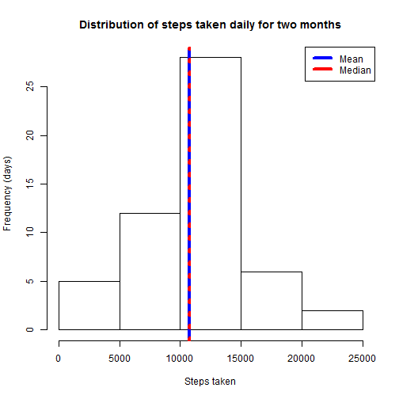
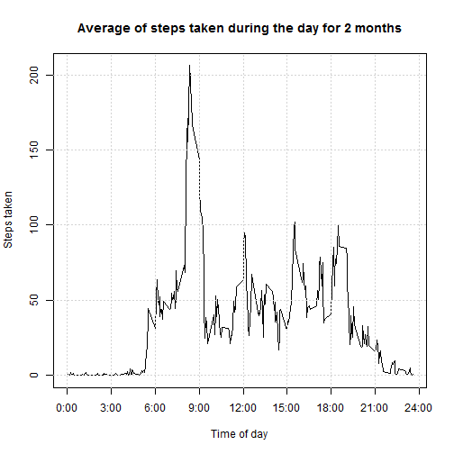
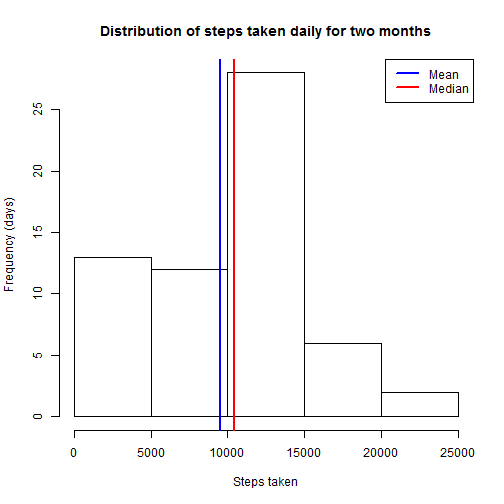
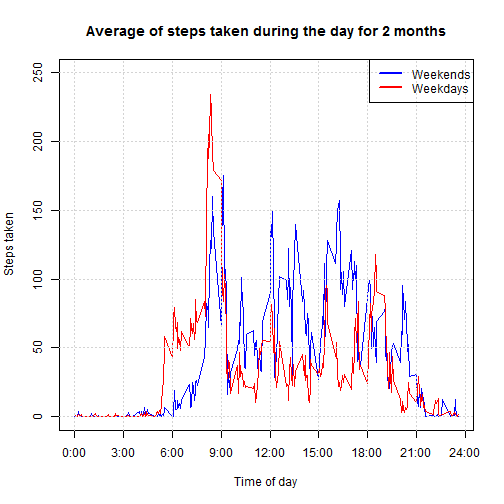

Project Assignment 1
=========

## Introduction

It is now possible to collect a large amount of data about personal movement using activity monitoring devices such as a Fitbit, Nike Fuelband, or Jawbone Up. These type of devices are part of the "quantified self" movement - a group of enthusiasts who take measurements about themselves regularly to improve their health, to find patterns in their behavior, or because they are tech geeks. But these data remain under-utilized both because the raw data are hard to obtain and there is a lack of statistical methods and software for processing and interpreting the data.

This assignment makes use of data from a personal activity monitoring device. This device collects data at 5 minute intervals through out the day. The data consists of two months of data from an anonymous individual collected during the months of October and November, 2012 and include the number of steps taken in 5 minute intervals each day.

### Data
The data for this assignment was downloaded from the course web site and it consists of a comma-separated-value (CSV) file containing three variables 
and a total of 17,568 observations:

* steps: Number of steps taking in a 5-minute interval (missing values are coded as NA)

* date: The date on which the measurement was taken in YYYY-MM-DD format

* interval: Identifier for the 5-minute interval in which measurement was taken


### Assignment
This assignment will require to write a report that answers the questions detailed below.

#### 0.- Loading and Preprocessing data
First, we need to load and preprocess the data, in this case, the data file should be contained in the working directory

```r
mydata <- read.csv("activity.csv")
```

Once the file has been loaded, the next step is to coarse the date variable into  `date` format 

```r
mydata$date <- as.Date(mydata$date, format = "%Y-%m-%d")
```

Besides, we can also get the time where the recordings were taken, that is, assuming the column "interval", indicates the time of day when the reading was taken, we re-format that column into time format `HH:MM:SS`

```r
## firts, we extract the hours and minutes from the column interval
h <- substr(mydata$interval, nchar(mydata$interval)-3, nchar(mydata$interval)-2)
m <- substr(mydata$interval, nchar(mydata$interval)-1, nchar(mydata$interval))
s <- rep("00",nrow(mydata))
## since there will be rows in column 'hours' with empty values, we replace them
## with "0"
h[h == ""] <- "0"
## then, add a column with the entire time
mydata$time <- as.factor(paste(h,m,s, sep = ":"))
## In order to have full control on the date and time, we paste date and time together into a single column
mydata$fulldate <- paste(mydata$date, mydata$time, sep = " ")
mydata$fulldate <- strptime(mydata$fulldate, "%Y-%m-%d %H:%M:%OS")
```
Once data has been preprocessed, questions can be properly addressed.

#### 1.- What is mean total number of steps taken per day?
To answer this question, we need to get some basic statistical values from the data, for this, we use:


```r
## Obtaining the totals for each recording time
t_steps_daily <- tapply(mydata$steps, mydata$date, sum)

## then the mean, median, min & max values (mean is formated to look prettier)
mean_t_steps <- format(mean(t_steps_daily, na.rm = TRUE), digits=6, nsmall=1)
median_t_steps <- median(t_steps_daily, na.rm = TRUE)
min_t_steps <- min(t_steps_daily, na.rm = TRUE)
max_t_steps <- max(t_steps_daily, na.rm = TRUE)
```

Analizing the results, we observe that during the 2 months the experiment lasted, an average of 10766.2, were taken per day, similarly, the median of daily steps taken per day was 10765, however, on the least active day, only 41 where taken (just from bed to bathroom!), in contrast,  the maximum steps recorded on a single day was 21194.

The following histogram show the distribution of steps taken per day. Here we can see that the steps taken per day follow a normal distribution, in which the peak of steps taken per day is within the range of 10,000 - 15,000, with more than 25 days recording values within this range. On the extremes, only five days recorded less (or equal) than 5,000 steps per day, whereas just two days recorded more than 20,000 steps in total each day.

```r
hist(t_steps_daily, 
     main = "Distribution of steps taken daily for two months",
     xlab = "Steps taken",
     ylab = "Frequency (days)"
     )
abline(v = mean_t_steps, col = 'blue', lty = "solid", lwd = 4)
abline(v = median_t_steps, col = 'red', lty="dotted", lwd = 4)
legend("topright",c("Mean", "Median"), lwd = c(4,4), col = c("blue", "red"))
```

 


#### 2.- What is the average daily activity pattern?
In order to identify the times of the day in which there is more walking activity (at least during the period in which the experiment was carried out), recordings belonging to the same time of the day for the entire two months were added together and then avergaged. The following code obtains the average daily activity and plots the results:

```r
only_valid <- !is.na(mydata$steps)   ## filter out NA records
mydata_valid <- mydata[only_valid,]
every_5mins <- tapply(mydata_valid$steps, mydata_valid$interval, mean)
my_y <- unique(mydata_valid$interval)

max_value <- max(every_5mins)        ## Determining the max value

plot(my_y, every_5mins,
     main = "Average of steps taken during the day for 2 months",
     ylab = "Steps taken",
     xlab = "Time of day",
     type = "l",
     xaxt = "n",
     )
axis(side = 1, at = c(0, 300, 600, 900, 1200, 1500, 1800, 2100, 2400), 
     labels = c("0:00","3:00","6:00","9:00","12:00","15:00","18:00",
                "21:00","24:00"))
## A grid is manually "added" by placing h & v gray dotted lines
## since grid() randomly chooses where the grid is placed
abline(v=(seq(0,2400,300)), col="lightgray", lty="dotted")
abline(h=(seq(0,200,  50)), col="lightgray", lty="dotted")
```

 

As the plot indicates, the peakest walking activity during the day ocurrs between 8:00 and 9:00 in the morning, which is the time (presumedly) in which the person in the experiment walks to his/her work. At 12:00, it migth be lunch time, therefore this somewhat high walking activity should be the walk to the canteen or cafeteria. I guess the peaks right after 17:00 and 19:00, they should be the walk to the pub and the way back home. It stands out that the walking activity is pretty much null right after 21:00, which I think is too early for bedtime.  


#### 3.- Imputing missing values
Missing values might be in some cases crucial for the analysis, especially if the amount of missing data is high, hence the importance of knowing the impact of these values on the total of cases. The next code aims to estimate the percentage of missing values on the experiment:

```r
totalNA <- sum(is.na(mydata$steps))
percentageNA <- format(100*totalNA/nrow(mydata),digits = 3,nsmall = 1)
```

In this experiment, a total of 2304 cases were reported as `NA`, that is, 13.1 % of total cases, which is not a negligable proportion, therefore, we need to find out a way to recover at least most of the missing data. 

In most cases, there is no way to recover missing data, but a way to estimate these gaps is by placing either the average or median of the activity for times in which there is activity, in this experiment, imputing missing values is carried out by placing the median steps taken during the time of day in which the missing value had occurred: 

```r
dataimputed <- mydata                ## a copy of the original data is created
                                     ## to substitute NA data with imputed data

only_valid <- !is.na(dataimputed$steps)   ## filter out NA records ...
not_valid  <- is.na(dataimputed$steps)    ## and identify NA records 

mydata_valid   <- dataimputed[only_valid,]
mydata_invalid <- dataimputed[not_valid,]

median_imputables <- tapply(mydata_valid$steps, mydata_valid$interval, median)

for (i in 1:nrow(dataimputed)){
          if (is.na(dataimputed$steps[i])){    ## i is the index for NA
               idx <- match(dataimputed$interval[i], names(median_imputables))
               dataimputed$steps[i] <- median_imputables[idx]
          }
}
```

Once missing values have been imputed, we repeat the steps taken before (question 1) to analyze the bahavior proceed to obtain values previos comparison

```r
t_steps_daily2 <- tapply(dataimputed$steps, dataimputed$date, sum)
mean_t_steps2 <- format(mean(t_steps_daily2, na.rm = TRUE), digits=5, nsmall=1)
median_t_steps2 <- median(t_steps_daily2, na.rm = TRUE)
min_t_steps2 <- min(t_steps_daily2, na.rm = TRUE)
max_t_steps2 <- max(t_steps_daily2, na.rm = TRUE)
```

Analizing the results, we observe that during the 2 months the experiment lasted, an average of 9503.9, were taken per day, which differes from the median of daily steps (10395), this difference is due to the imputed data, which pulled the mean towards the left. On the other hand, the minimum of steps in these period was 41 whereas the maximum recorded was 21194.


The following histogram show the distribution of steps taken per day. Here we can see that the steps taken per day show a positive skewed normal distribution, which was caused by the imputed values, which in most cases, the median was a low value, unlike the mean value which might have tried to pull the estimated values towards the center of gravity, because the mean is affected by extreme values.

```r
hist(t_steps_daily2, 
     main = "Distribution of steps taken daily for two months",
     xlab = "Steps taken",
     ylab = "Frequency (days)"
     )
abline(v = mean_t_steps2,  col = 'blue', lwd = 2)
abline(v = median_t_steps2, col = 'red', lwd = 2)
legend("topright",c("Mean", "Median"), lwd = c(2,2), col = c("blue", "red"))
```

 


#### 4.- Are there differences in activity patterns between weekdays and weekends?
Normally, the walking activity differs from weekdays to weekends, that is because during weekends the activity pattern changes because there is not need to walk to work. Prior analyzing the differences between weekends and weekdays, we need to add a column to identify whether the date is a weekend (Saturday & Sundays) or a weekday (Monday - Friday):


```r
mydata_valid <- mydata[only_valid,]

mydata$typeofday[((weekdays(mydata$date) == "Saturday") | 
                  (weekdays(mydata$date) == "Sunday"))] <- "weekend"

mydata$typeofday[is.na(mydata$typeofday)] <- "weekday"

mydata$typeofday <- as.factor(mydata$typeofday)

only_valid <- !is.na(mydata$steps)   ## filter out NA records
mydata_valid <- mydata[only_valid,]
mydata_valid_we <- mydata_valid[mydata_valid$typeofday == "weekend",]
mydata_valid_wd <- mydata_valid[mydata_valid$typeofday == "weekday",]

every_5mins_we <- tapply(mydata_valid_we$steps, mydata_valid_we$interval, mean)
every_5mins_wd <- tapply(mydata_valid_wd$steps, mydata_valid_wd$interval, mean)

my_y_we <- unique(mydata_valid_we$interval)
my_y_wd <- unique(mydata_valid_wd$interval)
```

Once dates have been tagged as "weekend" or "weekday", and statistical values have been obtained, the following plot shows very well differences in walking patterns between these dates:

```r
plot(my_y_we, every_5mins_we,
     main = "Average of steps taken during the day for 2 months",
     ylab = "Steps taken",
     ylim = c(0, 250),
     xlab = "Time of day",
     type = "n",
     xaxt = "n",
     )
axis(side = 1, at = c(0, 300, 600, 900, 1200, 1500, 1800, 2100, 2400), 
     labels = c("0:00","3:00","6:00","9:00","12:00","15:00","18:00",
                "21:00","24:00"))

## Once the frame has been created, weekday's and weekend's lines are added
lines(my_y_we, every_5mins_we, col = "blue",lwd = 1.5)
lines(my_y_wd, every_5mins_wd, col = "red" ,lwd = 1.5)

## A grid is manually "added" by placing h & v gray dotted lines
## since grid() randomly chooses where the grid is placed
abline(v=(seq(0,2400,300)), col="lightgray", lty="dotted")
abline(h=(seq(0,250,  50)), col="lightgray", lty="dotted")

## The legend is added to identify what the lines mean
legend("topright",c("Weekends", "Weekdays"), lwd = c(2,2), col = c("blue", "red"))
```

 

The plot clearly depicts how the walking activity in weekends decreases in the morning, but it also increases during the afternoon, which is when shopping is carried out, or perhaps, just a walk for simple pleasure. In any case, it is clear that behaviour changes between days off and busy days.


#### Conclusions
This is just a venturesome attempt to describe the walking activity of somebody who has recorded the steps taken during the day for two months, by no means, I am not trying this analysis neither to be exhaustive nor to be taken seriously, but just to contribute with my mates showing the decisions I had taken to solve this project assignment, which I hope you find it illustrative. I would appreciate any contribution and critics to 
this work, since they will help me learn both R programming and data analysis.


